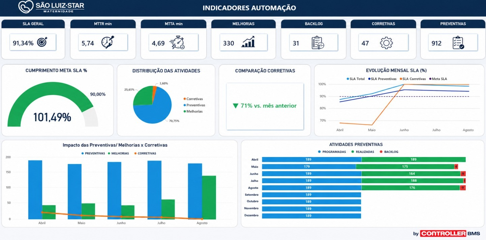

<!-- ========================= -->
<!-- BANNER -->
<!-- ========================= -->

  

 

<!-- ========================= -->
<!-- SOBRE MIM -->
<!-- ========================= -->

<table>
<tr>

<td width="67%" valign="top">

<h1>Olá, eu sou a Cristina 👩‍💻</h1>

<h3>⚡ Eletricista de Manutenção Eletroeletrônica</h3>

<h3>🏢 Automação Predial • BMS • Tecnologia</h3>

Profissional da área de <b>manutenção eletroeletrônica e automação predial</b>, com experiência em sistemas BMS, integração de equipamentos, sistemas supervisórios e infraestrutura técnica.

Atualmente também estou expandindo meus conhecimentos em <b>tecnologia e desenvolvimento</b>, utilizando programação para criar ferramentas aplicadas à automação, manutenção, gestão e melhoria de processos.

</td>

<td width="33%" align="center" valign="middle">

</td>

</tr>
</table>

<!-- ========================= -->
<!-- AUTOMAÇÃO -->
<!-- ========================= -->

## ⚡ Automação & Sistemas

- ⚡ Manutenção Eletroeletrônica
- 🏢 Automação Predial / BMS
- 🖥️ Sistemas Supervisórios
- 🔗 BACnet e Modbus
- 🎛️ CLPs e Controladoras
- 📡 Sensores e Instrumentação
- 📊 Análise de dados e indicadores
- 🔌 Integração de Sistemas

---

<!-- ========================= -->
<!-- FERRAMENTAS -->
<!-- ========================= -->

## 🖥️ Plataformas & Ferramentas

 

---

<!-- ========================= -->
<!-- DESENVOLVIMENTO -->
<!-- ========================= -->

## 💻 Desenvolvimento

Atualmente estou ampliando meus conhecimentos em desenvolvimento através da criação de projetos práticos.

 

---

<!-- ========================= -->
<!-- PROJETOS -->
<!-- ========================= -->

## 🚀 Projetos em Destaque

<table width="100%">

<!-- TÍTULOS -->
<tr>

<td width="50%" align="center">
<h3>💬 Plataforma de Feedback</h3>
</td>

<td width="50%" align="center">
<h3>📊 Dashboard de Manutenção</h3>
</td>

</tr>

<!-- IMAGENS -->
<tr>

<td width="50%" align="center" valign="middle">

</td>

<td width="50%" align="center" valign="middle">

</td>

</tr>

<!-- DESCRIÇÕES -->
<tr>

<td width="50%" valign="top">

Aplicação desenvolvida para estruturar e acompanhar <b>feedbacks profissionais</b>, permitindo organizar avaliações, evolução e planos de ação.

</td>

<td width="50%" valign="top">

Dashboard desenvolvido em <b>Power BI</b> para acompanhamento de indicadores de manutenção, desempenho operacional e evolução das atividades.

</td>

</tr>

<!-- SUBTÍTULOS -->
<tr>

<td width="50%" valign="bottom">
<b>Tecnologias</b>
</td>

<td width="50%" valign="bottom">
<b>Indicadores</b>
</td>

</tr>

<!-- BADGES PRINCIPAIS -->
<tr>

<td width="50%" valign="top">

</td>

<td width="50%" valign="top">

</td>

</tr>

<!-- ÚLTIMA LINHA -->
<tr>

<td width="50%" align="center" valign="middle">

</td>

<td width="50%" valign="middle">

</td>

</tr>

</table>

 

---
---

<!-- ========================= -->
<!-- CONTATO -->
<!-- ========================= -->

<!-- ========================= -->
<!-- CONTATO -->
<!-- ========================= -->

<!-- ========================= -->
<!-- CONTATO -->
<!-- ========================= -->

## 🌐 Conecte-se comigo

  &nbsp;&nbsp;

  ⚡ <b>Automação • Tecnologia • Desenvolvimento</b>
